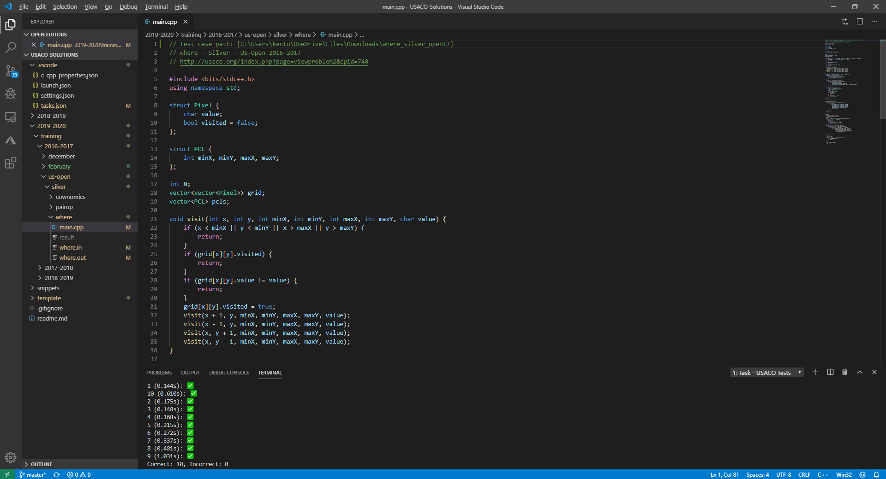

# USACO-Grader
An automatic grader for problems from [usaco.org](http://www.usaco.org/).



# Requirements
* Windows 10
* Windows Subsystem for Linux
* Python
* g++

# Setup
``grader.py`` can be run as a normal script, or it can be configured as a task.

Running the program normally:
* Run the script using ``python``.

    ```bash
    python grader.py
    ```

* Input your solution and test case paths.
    > The program accepts one optional command line argument, which is the path to your solution file (C++). For more information, refer to the [Editor Integration](#Editor-Integration) section.

# Editor Integration
* Test case folders can be specified at the top of your solution in the following format in the first line of your code:
    ```cpp
    // Test case path: [path]
    ```
    > Path is an absolute file path to your test case folder.

    > Test case folders should contain files with extensions ``in`` and ``out``.
* In editors such as [Visual Studio Code](https://code.visualstudio.com/), you can configure this program as a [task](https://code.visualstudio.com/Docs/editor/tasks). An example of the task configurations can be found [here](https://github.com/KentoNishi/.vscode/tree/USACO-Settings).